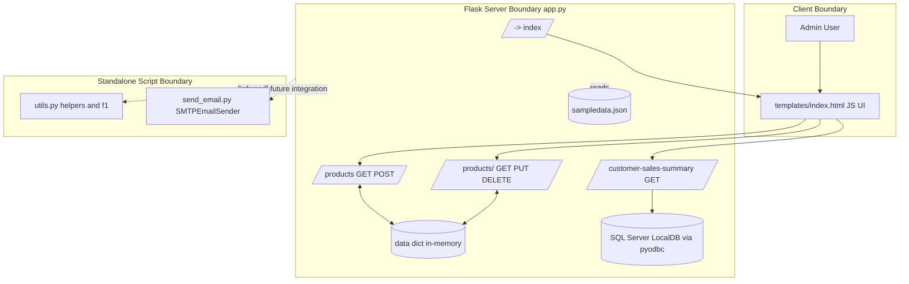
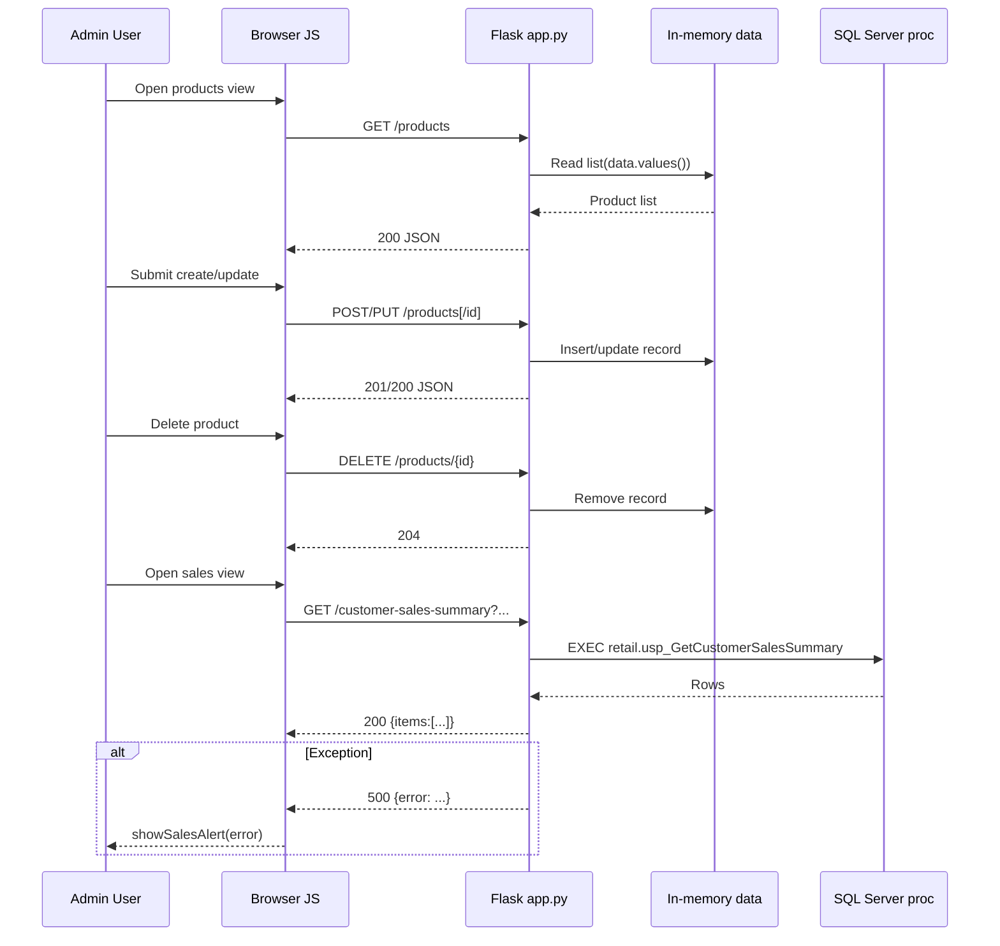

## Executive Summary
What it does:
- This codebase is a Flask-centered backoffice demo that serves a single HTML UI, exposes product CRUD APIs, and includes a SQL-backed sales summary endpoint.
- The repository also contains standalone helper/script modules (`utils.py`, `send_email.py`) that are not currently integrated into the request path.

Why it matters:
- The main user-facing workflow is simple to understand and fast to demo.
- Operational and security quality are uneven because state is in-memory, auth is absent, and test coverage is narrow.

Evidence:
- app.py | app/index/routes | Flask app setup, route handlers, template rendering
- templates/index.html | API_URL/loadProducts/loadSalesSummary | frontend API contract and fetch flows
- utils.py/send_email.py | f1/SMTPEmailSender | standalone utility/script paths

Confidence: High

## System Architecture
What it does:
- A monolithic Flask app hosts both UI and JSON APIs.
- Architecture has three practical layers: UI template + browser JS, Flask route layer, and data/external integration layer.
- Product data path uses a process-local in-memory dictionary, while sales summary path uses SQL Server stored procedure execution.

Why it matters:
- The UI↔API contract is tightly coupled in one template file, which speeds iteration but increases blast radius for contract changes.
- Mixed persistence models (in-memory vs DB) create different reliability expectations across features.

Evidence:
- app.py | app/CORS | `app = Flask(__name__)`, `CORS(app)`
- app.py | data | `data = {}` in-memory store
- app.py | index | `return render_template('index.html')`
- app.py | get_customer_sales_summary | executes `EXEC retail.usp_GetCustomerSalesSummary`
- templates/index.html | API_URL | `const API_URL = '/products';`
- templates/index.html | loadSalesSummary | fetches `/customer-sales-summary?...`

Confidence: High

## Key Modules and Responsibilities
What it does:
- `app.py`
  - Hosts HTTP routes (`/`, `/products`, `/customer-sales-summary`, `/getdata`).
  - Performs request validation, CRUD state mutation, SQL proc invocation, response shaping.
- `templates/index.html`
  - Implements SPA-like section switching and API calls.
  - Renders products and sales tables; manages modal/form flows.
- `utils.py`
  - Provides helpers (email validation, password utilities, logging, filename generation).
  - Contains `f1` pipeline for SQLite reads + XML export.
- `send_email.py`
  - Defines `SMTPEmailSender` for SMTP send flow and local script `main()` demo.
- `test_utils.py`, `test_app.py`
  - `test_utils.py` covers email regex behavior.
  - `test_app.py` is currently placeholder-level.

Why it matters:
- Active product/sales functionality is clear, but some modules appear decoupled from runtime app behavior.
- Documentation and tests should explicitly separate production paths from helper/demo scripts.

Evidence:
- app.py | create_product/update_product/delete_product | CRUD mutation via global dict
- app.py | get_connection/get_customer_sales_summary | DB connection and row shaping
- templates/index.html | showPage/openProductModal/closeProductModal/showAlert | UI orchestration
- utils.py | f1/is_valid_email/hash_password | utility core symbols
- send_email.py | SMTPEmailSender.__init__/send_email/main | script-side outbound mail flow
- test_utils.py | parametrize cases | validator tests

Confidence: High

## Runtime and Data Flow
What it does:
- Startup flow:
  - Flask initializes app, CORS, logging, and route map; dev server runs on port 5000.
  - Browser loads `/` and bootstraps client functions.
- Product flow:
  - Frontend fetches `/products`, submits POST/PUT/DELETE.
  - Backend validates payload and mutates in-memory `data` store.
- Sales flow:
  - Frontend calls `/customer-sales-summary` with query params.
  - Backend executes stored proc, converts rows to dicts, returns `{items:[...]}`.
- Auxiliary flow:
  - `send_email.py` and `utils.f1` are executable/usable independently of Flask routes.

Why it matters:
- Primary runtime behavior depends on frontend/backend contract consistency and backend dependency availability (ODBC, SQL proc).
- In-memory product state is non-durable and can diverge in multi-worker deployments.

Evidence:
- app.py | __main__ | `app.run(debug=True, port=5000)`
- templates/index.html | loadProducts | `await fetch(API_URL)`
- app.py | create_product | UUID generation and dict insert
- templates/index.html | loadSalesSummary | `fetch(`/customer-sales-summary?...`)`
- app.py | get_customer_sales_summary | cursor execute/fetch/serialize
- app.py | get_data | intentionally error-prone operations

Confidence: High for observed flows; Medium for deployment behavior inferences.

## Mermaid Diagrams
What it does:
- Visualizes architecture boundaries and runtime request lifecycle.

Why it matters:
- Makes coupling and failure surfaces easier to understand quickly for onboarding and reviews.

Evidence:
- app.py | route handlers + DB call | product and sales endpoints
- templates/index.html | fetch-based workflows | product/sales UI interactions
- utils.py/send_email.py | standalone flows | sidecar behavior

Confidence: High

### Architecture Diagram

### Runtime/Data-Flow Diagram

## Security Notes
What it does:
- Highlights existing controls and high-priority gaps in trust boundaries, route protections, and error handling.

Why it matters:
- Current defaults expose sensitive operations and internals more than expected for non-demo environments.

Evidence:
- app.py | route set | no auth/authz checks on CRUD and sales endpoints
- app.py | CORS(app) | global permissive CORS enablement
- app.py | exception path | returns `{"error": str(exc)}`
- app.py | startup | `debug=True`
- utils.py | hash_password | unsalted SHA-256 helper
- send_email.py | __init__ | mixed env + hardcoded credential placeholders

Confidence: High

## Accessibility Notes
What it does:
- Documents semantic and assistive-tech-related strengths and gaps in the UI template.

Why it matters:
- Keyboard and dialog/focus issues have immediate impact on operability for assistive technology users.

Evidence:
- Positive:
  - templates/index.html | html lang + labels + role alert in showAlert
- Gaps:
  - templates/index.html | nav/footer links | onclick anchors without href
  - templates/index.html | modal | lacks full dialog semantics/focus lifecycle
  - templates/index.html | showSalesAlert | no alert role/live region
  - templates/index.html | focus:outline-none usage | potential visible focus regression

Confidence: High for code-observed issues; Medium for visual contrast impact.

## Risks, Gaps, and Unknowns
What it does:
- Consolidates highest-value unknowns and risks for follow-up.

Why it matters:
- Prioritizes remediation and clarifies where additional validation is needed.

Evidence + confidence:
- High: unauthenticated mutation and reporting endpoints (app.py routes) — High confidence.
- High: debug mode enabled in startup path — High confidence.
- Medium: raw exception detail leakage in API error response — High confidence.
- Medium: CORS policy breadth requires environment-specific restriction — High confidence.
- Medium: `utils.f1` runtime ownership/intent unclear in app context — Medium confidence.
- Medium: frontend pagination expectations may differ from backend response shape (`items` only) — Medium confidence.

## Evidence Index
- app.py
  - `app`, `CORS(app)`, `data`, CRUD handlers, `get_connection`, `get_customer_sales_summary`, `__main__`
- templates/index.html
  - `API_URL`, `showPage`, `loadProducts`, `loadSalesSummary`, `openProductModal`, `closeProductModal`, `showAlert`, `showSalesAlert`
- utils.py
  - `f1`, `is_valid_email`, `hash_password`, `is_strong_password`, log/file helpers
- send_email.py
  - `SMTPEmailSender.__init__`, `SMTPEmailSender.send_email`, `main`
- tests
  - `test_utils.py` parameterized email validation tests
  - `test_app.py` placeholder

## Recommended Next Documentation Tasks
- Define explicit API contract docs for `/customer-sales-summary` response model (including pagination semantics).
- Add security model doc (authn/authz expectations, CORS policy, error sanitization policy).
- Add accessibility interaction spec for navigation and modal keyboard/focus behavior.
- Clarify `utils.f1` lifecycle status (active feature vs legacy utility) and ownership.
- Expand testing documentation with target coverage for API, security, and accessibility-critical paths.