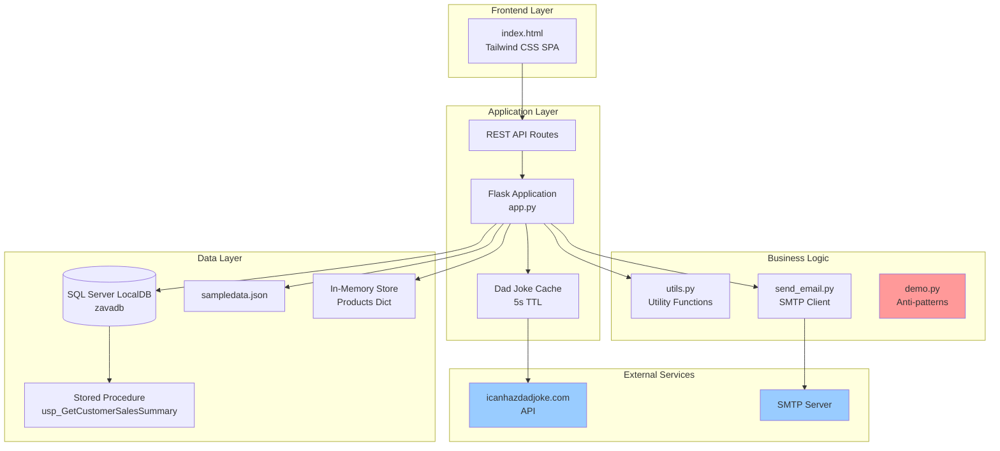
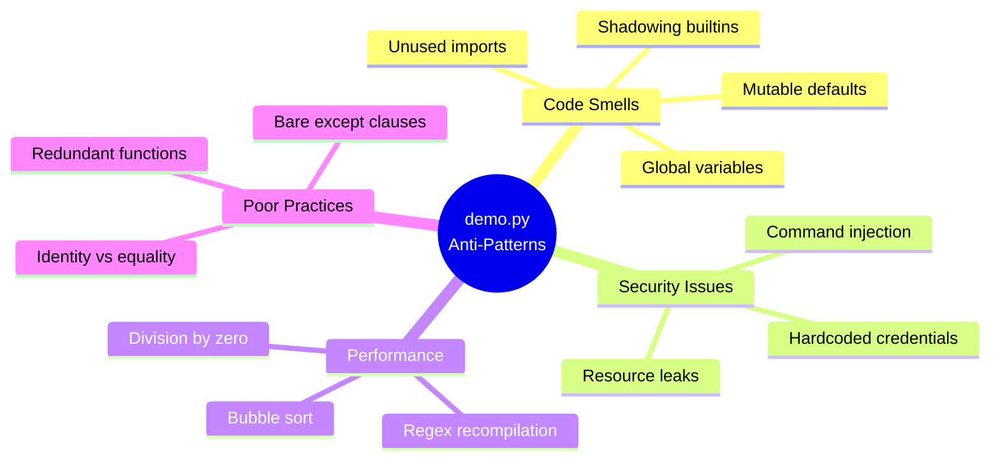
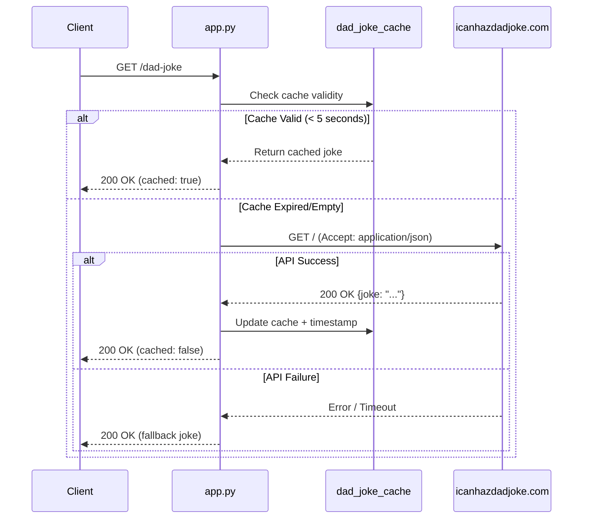
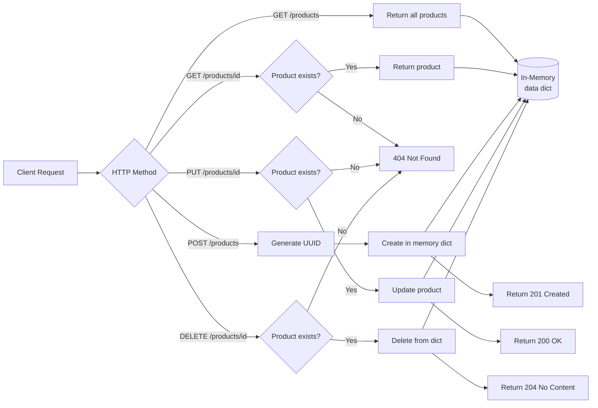
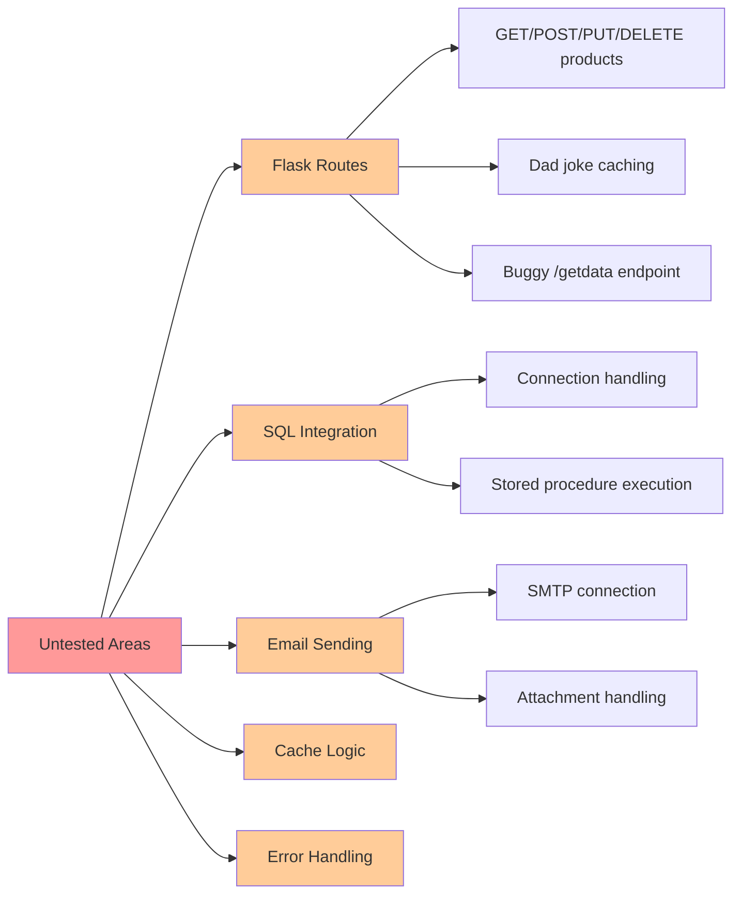
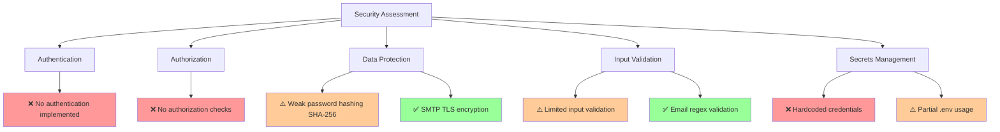
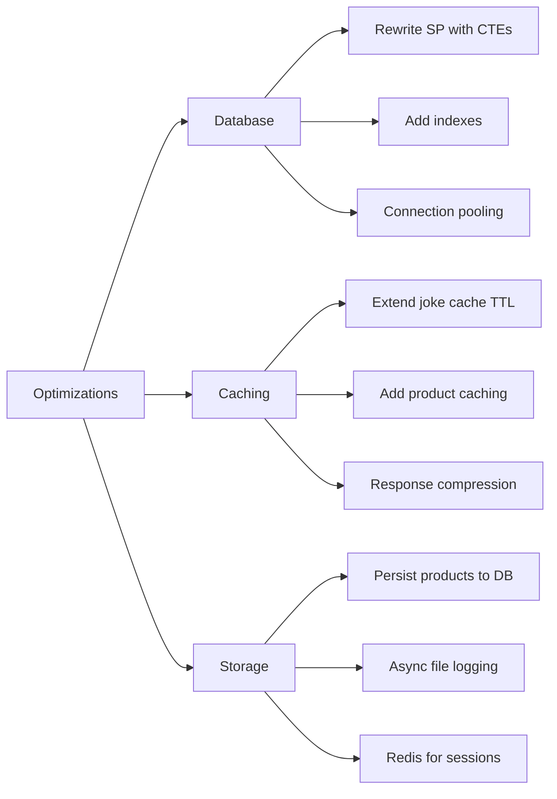

# ZavaDemo Codebase Documentation

**Generated:** April 22, 2026  
**Repository:** ahmedsza/ghcpjumpstart  
**Branch:** ghcpdemo  
**Active PR:** [#18 - Add dad joke feature and demo application utilities](https://github.com/ahmedsza/ghcpjumpstart/pull/18)

---

## Executive Summary

ZavaDemo is a Flask-based web application that serves as a demonstration/testing platform featuring a product management REST API, SQL Server integration, email functionality, and a dad joke feature. The project includes intentionally problematic code patterns for educational or testing purposes, alongside production-quality features.

**Key Characteristics:**
- **Primary Language:** Python (Flask framework)
- **Database:** SQL Server (LocalDB)
- **Frontend:** HTML with Tailwind CSS
- **Purpose:** Demo/testing application with mixed code quality patterns

---

## Architecture Overview



---

## Component Breakdown

### 1. Flask Application (`app.py`)

**Purpose:** Main web server and REST API implementation

**Key Features:**
- Product CRUD operations (in-memory storage)
- SQL Server integration with stored procedure calls
- Dad joke API with caching mechanism
- Intentionally buggy `/getdata` endpoint for testing
- CORS enabled for all routes

**API Endpoints:**

| Method | Endpoint | Description | Storage |
|--------|----------|-------------|---------|
| GET | `/` | Serve index.html | N/A |
| GET | `/getdata` | ⚠️ Buggy data retrieval | JSON file |
| GET | `/products` | List all products | In-memory |
| GET | `/products/<id>` | Get product by ID | In-memory |
| POST | `/products` | Create new product | In-memory |
| PUT | `/products/<id>` | Update product | In-memory |
| DELETE | `/products/<id>` | Delete product | In-memory |
| GET | `/customer-sales-summary` | Execute stored procedure | SQL Server |
| GET | `/dad-joke` | Get cached dad joke | External API |

**Configuration:**
```python
SQL_SERVER_CONFIG = {
    "server": r"(localdb)\MSSQLLocalDB",
    "database": "zavadb",
    "driver": "{ODBC Driver 17 for SQL Server}",
    "trusted_connection": "yes",
}
```

**Caching Strategy:**
- Dad jokes cached for 5 seconds
- Cache includes timestamp and age tracking
- Fallback joke on API failure

---

### 2. Utility Functions (`utils.py`)

**Purpose:** Shared utility functions and complex data processing

**Main Function - `f1()`:**
- **Complexity:** High (deeply nested logic, single-letter variables)
- **Operations:** 
  - SQLite database queries with complex aggregations
  - Multi-stage data filtering and scoring
  - XML export with ElementTree
- **Code Quality:** ⚠️ Poor (obfuscated variable names, complex nesting)

**Helper Functions:**

| Function | Purpose | Quality |
|----------|---------|---------|
| `is_valid_email()` | Email validation with regex | ✅ Good |
| `hash_password()` | SHA-256 password hashing | ⚠️ Weak (use bcrypt) |
| `is_strong_password()` | Password strength validation | ✅ Good |
| `log_message()` | Append to log file | ⚠️ No error handling |
| `generate_unique_filename()` | Timestamp-based filenames | ✅ Good |
| `read_log()` | Read log file | ⚠️ File not closed properly |

---

### 3. Demo Anti-Patterns (`demo.py`)

**Purpose:** Collection of intentional code smells and anti-patterns for educational purposes

**Anti-Patterns Demonstrated:**



**Specific Issues:**
- ⚠️ `PASSWORD = "SuperSecret123!"` - Hardcoded credential
- ⚠️ `list = "I am a string now"` - Shadows built-in
- ⚠️ `add_item(item, collection=[])` - Mutable default argument
- ⚠️ `compute(x, y)` - Division by zero, identity check with `is`
- ⚠️ `do_network_like_call()` - Command injection vulnerability
- ⚠️ `parse_file_bad()` - Resource leak (file not closed)

---

### 4. Email Service (`send_email.py`)

**Purpose:** SMTP email sender with attachment support

**Class:** `SMTPEmailSender`

**Features:**
- Environment-based configuration (via `.env`)
- Multiple recipient support
- HTML email bodies
- File attachments with MIME encoding
- TLS encryption

**⚠️ Security Concerns:**
- Hardcoded credentials override environment variables:
  ```python
  self.smtp_username = "username"  # Should use os.getenv()
  self.smtp_password = "smtp_password"  # Should use os.getenv()
  ```

---

### 5. Frontend (`templates/index.html`)

**Purpose:** Single-page application for Zava shopping platform

**Technology Stack:**
- Tailwind CSS (CDN)
- Vanilla JavaScript
- Google Fonts (Inter)

**Features:**
- Responsive navigation
- Page-based routing (SPA pattern)
- Smooth animations and transitions
- Modal support
- Mobile menu toggle

**Design:**
- Minimalist black/white color scheme
- Custom animations (fadeIn, slideDown)
- Sticky navigation
- Typography-focused layout

---

### 6. Database Layer

#### SQL Stored Procedure (`sqlstoredproc.sql`)

**Procedure:** `retail.usp_GetCustomerSalesSummary`

**Purpose:** Generate comprehensive customer sales analytics

**⚠️ Performance Issues:**
- Multiple correlated subqueries (N+1 pattern)
- Repeated calculations in CASE statements
- No WHERE clause filtering capability
- Scalar subqueries in SELECT list

**Data Retrieved:**
- Customer information (ID, name, email)
- Total orders and lifetime spend
- Last order date
- Primary store details
- Product and category information
- Customer tier classification (VIP/Gold/Standard)

**Optimization Needed:** Rewrite with JOINs and CTEs for better performance

---

## Data Flow Diagrams

### Dad Joke API Flow



### Product CRUD Flow



---

## File Structure & Purpose

```
ZavaDemo/
├── app.py                     # Main Flask application (210 lines)
├── utils.py                   # Utility functions (178 lines)
├── demo.py                    # Anti-pattern examples (95 lines)
├── send_email.py              # SMTP email client (110+ lines)
├── test_app.py                # Unit test file (minimal)
├── test_utils.py              # Email validation tests (pytest)
├── requirements.txt           # Python dependencies
├── sampledata.json            # Sample user data
├── sample_data.csv            # CSV data file
├── sqlstoredproc.sql          # Database stored procedure
├── code.txt                   # Auxiliary code
├── extracode.txt              # Extra code samples
├── LICENSE                    # License file
├── templates/
│   └── index.html            # Frontend SPA (Tailwind CSS)
└── outputs/
    └── code-understanding-report.md  # Documentation
```

---

## Dependencies & Technology Stack

### Python Dependencies (`requirements.txt`)

| Package | Purpose | Version |
|---------|---------|---------|
| **Flask** | Web framework | Latest |
| **flask-cors** | CORS support | Latest |
| **pyodbc** | SQL Server connectivity | Latest |
| **SQLAlchemy** | ORM (unused?) | ≥1.4.0 |
| **pytest** | Testing framework | Latest |
| **selenium** | Browser automation | Latest |
| **requests** | HTTP client (dad joke API) | Latest |
| **mkdocs-material** | Documentation (unused?) | Latest |

### External Services

1. **icanhazdadjoke.com** - Dad joke API
2. **SQL Server LocalDB** - Database engine
3. **SMTP Server** - Email delivery (configured via .env)

---

## Code Quality Analysis

### Strengths ✅

1. **Clear API Structure:** RESTful endpoint design
2. **Error Handling:** Try-catch blocks in critical paths
3. **Logging:** Structured logging with timing metrics
4. **Testing:** Parameterized pytest tests for email validation
5. **Caching:** Simple but effective dad joke caching
6. **Documentation:** Docstrings in key functions

### Issues & Technical Debt ⚠️

#### High Priority

1. **Security Vulnerabilities:**
   - Hardcoded credentials in `send_email.py`
   - SQL injection potential (mitigated by parameterized queries)
   - Weak password hashing (SHA-256 vs bcrypt)
   - Command injection in `demo.py`

2. **Intentional Bugs:**
   - `/getdata` endpoint has TypeError/KeyError bugs
   - Division by zero in `demo.py`

3. **Performance Issues:**
   - N+1 query pattern in stored procedure
   - In-memory product storage (not persistent)
   - File handle leaks in `utils.py`

#### Medium Priority

1. **Code Maintainability:**
   - `f1()` function is completely unreadable (single-letter variables)
   - Deep nesting in `demo.py` control flow
   - Duplicate functions (`multiply()` and `times()`)

2. **Missing Features:**
   - No database persistence for products
   - No authentication/authorization
   - No input validation on product creation
   - No rate limiting on API endpoints

#### Low Priority

1. **Code Style:**
   - Inconsistent import ordering
   - Mixed quote styles
   - Unused dependencies in requirements.txt

---

## Testing Strategy

### Existing Tests

**`test_utils.py`** - Email Validation Tests
- ✅ 8 valid email patterns tested
- ✅ 14 invalid email patterns tested  
- ✅ Uses pytest parameterization
- ✅ Covers edge cases (None, empty string, special chars)

**`test_app.py`**
- ⚠️ Currently empty/minimal

### Missing Test Coverage



---

## Integration Points

### External API Integration

**icanhazdadjoke.com API**
- **Endpoint:** `https://icanhazdadjoke.com/`
- **Method:** GET
- **Headers:** `Accept: application/json`
- **Timeout:** 5 seconds
- **Error Handling:** Fallback to default joke

### Database Integration

**SQL Server LocalDB (zavadb)**
- **Connection:** Trusted connection (Windows Auth)
- **Driver:** ODBC Driver 17 for SQL Server
- **Schema:** `retail` schema
- **Tables:** customers, orders, order_items, products, categories, stores
- **Procedure:** `retail.usp_GetCustomerSalesSummary`

### Email Integration

**SMTP Configuration (Environment Variables)**
- `SMTP_HOST` - SMTP server address
- `SMTP_PORT` - Port number (default: 587)
- `SMTP_USERNAME` - Authentication username
- `SMTP_PASSWORD` - Authentication password
- `FROM_EMAIL` - Sender email address
- `FROM_NAME` - Sender display name

---

## Configuration & Environment

### Required Environment Variables

```bash
# Email Configuration
SMTP_HOST=smtp.example.com
SMTP_PORT=587
SMTP_USERNAME=your_username
SMTP_PASSWORD=your_password
FROM_EMAIL=noreply@example.com
FROM_NAME=Zava Demo
```

### Database Setup

1. SQL Server LocalDB must be installed
2. Database `zavadb` must exist
3. Schema `retail` must be created
4. Stored procedure `usp_GetCustomerSalesSummary` must be deployed
5. ODBC Driver 17 for SQL Server required

### Application Configuration

- **Port:** 5000
- **Debug Mode:** Enabled (`app.run(debug=True)`)
- **CORS:** Enabled for all origins
- **Cache TTL:** 5 seconds (dad jokes)

---

## Development Patterns & Conventions

### Positive Patterns Observed

1. **RESTful Design:** Proper HTTP verbs and status codes
2. **Separation of Concerns:** Routes, logic, utilities separated
3. **Logging:** Structured logging with performance metrics
4. **Error Responses:** JSON error messages with appropriate status codes

### Anti-Patterns (Intentional in demo.py)

```python
# Mutable Default Arguments
def add_item(item, collection=[]):  # ⚠️ Shared state bug
    collection.append(item)
    return collection

# Shadowing Built-ins
list = "I am a string now"  # ⚠️ Breaks built-in list

# Command Injection
def do_network_like_call(url):
    cmd = "curl -s " + url  # ⚠️ Injection vulnerability
    os.system(cmd)

# Resource Leak
def parse_file_bad(path):
    f = open(path, "r")  # ⚠️ Never closed
    data = f.read()
    return data
```

---

## Security Considerations

### Current Security Posture



### Recommendations

1. **Immediate Actions:**
   - Remove hardcoded credentials from `send_email.py`
   - Implement input validation on all API endpoints
   - Replace SHA-256 with bcrypt for password hashing
   - Add rate limiting to prevent abuse

2. **Short Term:**
   - Implement JWT-based authentication
   - Add role-based authorization
   - Sanitize SQL inputs (though parameterized queries help)
   - Add HTTPS/TLS requirements

3. **Long Term:**
   - Security audit of all endpoints
   - Penetration testing
   - Implement security headers (CSP, HSTS, etc.)
   - Add comprehensive logging and monitoring

---

## Performance Considerations

### Current Bottlenecks

1. **Stored Procedure:** Correlated subqueries cause O(n²) complexity
2. **In-Memory Storage:** Products lost on restart, no persistence
3. **External API:** 5-second timeout on dad joke API
4. **File I/O:** Synchronous log file operations

### Optimization Opportunities



---

## Deployment Considerations

### Current Setup

- **Environment:** Development (debug mode enabled)
- **Server:** Flask development server
- **Database:** LocalDB (local development only)
- **Storage:** In-memory (volatile)

### Production Readiness Checklist

- [ ] Disable debug mode
- [ ] Use production WSGI server (Gunicorn/uWSGI)
- [ ] Migrate from LocalDB to production SQL Server
- [ ] Implement persistent product storage
- [ ] Add environment-based configuration
- [ ] Setup logging to external service
- [ ] Implement health check endpoints
- [ ] Add monitoring and alerting
- [ ] Configure reverse proxy (nginx)
- [ ] Setup SSL certificates
- [ ] Implement backup strategy
- [ ] Add deployment automation

---

## Future Enhancements

### Recommended Improvements

1. **Data Persistence:**
   - Move products to database
   - Add migration scripts
   - Implement ORM properly (SQLAlchemy currently unused)

2. **API Enhancements:**
   - Add pagination for products
   - Implement filtering and sorting
   - Add search functionality
   - Version the API (v1, v2)

3. **Testing:**
   - Complete unit test coverage
   - Add integration tests
   - Implement end-to-end tests (Selenium usage)
   - Performance testing

4. **Documentation:**
   - OpenAPI/Swagger specification
   - API documentation UI
   - Developer onboarding guide
   - Deployment runbook

5. **Monitoring:**
   - Application metrics (Prometheus)
   - Request tracing
   - Error tracking (Sentry)
   - Performance monitoring (APM)

---

## Key Takeaways

### Purpose of This Codebase

ZavaDemo serves as a **demonstration/testing application** with:
- ✅ Working REST API examples
- ✅ Database integration patterns
- ✅ External API consumption (dad jokes)
- ⚠️ Intentional anti-patterns for educational purposes
- ⚠️ Mixed code quality (production-ready alongside problematic code)

### Not Production Ready

This codebase contains:
- Hardcoded credentials
- Intentional bugs and vulnerabilities
- No authentication or authorization
- Volatile in-memory storage
- Development-only database setup

### Learning Resource

The codebase demonstrates:
- Flask application structure
- REST API design patterns
- Database integration with SQL Server
- External API consumption
- Email functionality via SMTP
- Common Python anti-patterns (for education)

---

## Quick Start Guide

### Prerequisites

```bash
# Install Python 3.x
# Install SQL Server LocalDB
# Install ODBC Driver 17 for SQL Server
```

### Setup

```bash
# Install dependencies
pip install -r requirements.txt

# Create .env file
cat > .env << EOF
SMTP_HOST=smtp.gmail.com
SMTP_PORT=587
SMTP_USERNAME=your_email@gmail.com
SMTP_PASSWORD=your_app_password
FROM_EMAIL=your_email@gmail.com
FROM_NAME=Zava Demo
EOF

# Setup database (ensure LocalDB is running)
sqlcmd -S "(localdb)\MSSQLLocalDB" -i sqlstoredproc.sql
```

### Run Application

```bash
python app.py
# Server starts on http://localhost:5000
```

### Test Endpoints

```bash
# Get all products
curl http://localhost:5000/products

# Create a product
curl -X POST http://localhost:5000/products \
  -H "Content-Type: application/json" \
  -d '{"name":"Test Product","price":99.99}'

# Get dad joke
curl http://localhost:5000/dad-joke

# Get customer sales summary
curl http://localhost:5000/customer-sales-summary
```

---

## Contact & Support

**Repository:** [ahmedsza/ghcpjumpstart](https://github.com/ahmedsza/ghcpjumpstart)  
**Current Branch:** ghcpdemo  
**Active PR:** #18 - Add dad joke feature and demo application utilities

---

*Documentation generated by CodeBaseResearcherLite on April 22, 2026*
