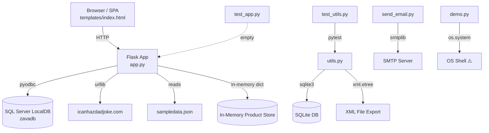
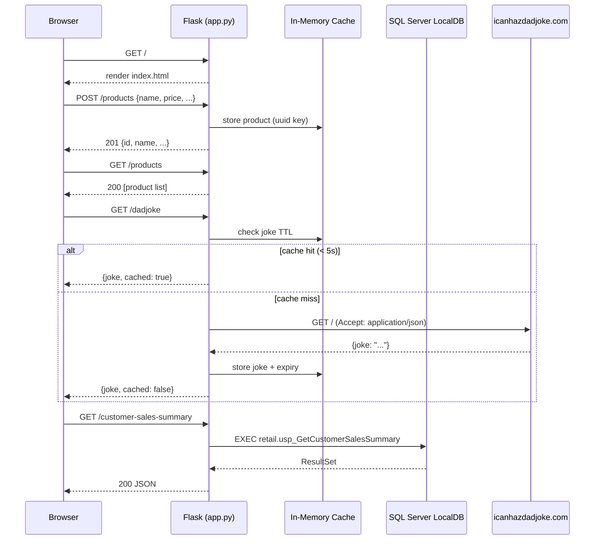
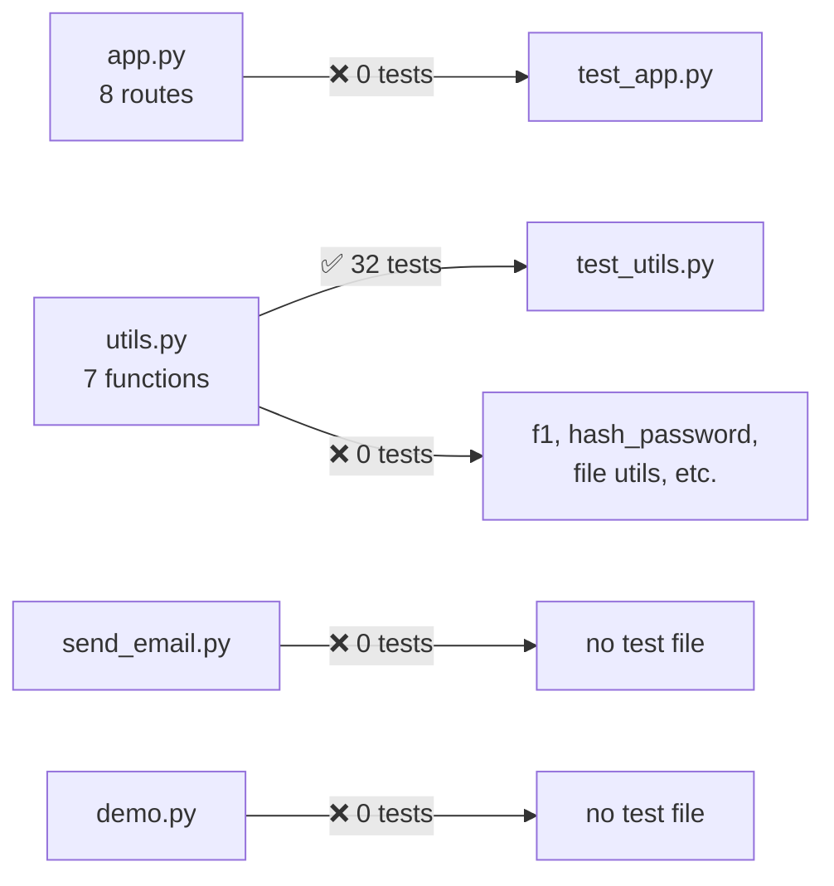

# Zava Demo — Codebase Documentation

## Project Summary

**ZavaDemo** is a Python/Flask demo application simulating an e-commerce backend ("Zava — Your Premium Shopping Destination"). It is primarily a teaching/demonstration codebase intentionally containing anti-patterns, bugs, and security issues for training purposes. The app exposes a REST API, connects to a SQL Server LocalDB instance, and serves a Tailwind CSS single-page frontend.

| Attribute | Value |
|---|---|
| Language | Python 3 |
| Web Framework | Flask + Flask-CORS |
| Frontend | Tailwind CSS (CDN), vanilla JavaScript SPA |
| Database | SQL Server LocalDB (pyodbc), SQLite (utils), sampledata.json |
| Email | SMTP via smtplib / python-dotenv |
| Tests | pytest |
| Branch | `ghcpdemo` |

---

## Architecture

---

## Key Components

### `app.py` — Flask Application Entry Point
- Configures Flask with CORS enabled for all origins
- Connects to SQL Server LocalDB (`(localdb)\MSSQLLocalDB`) via `pyodbc` trusted connection
- **In-memory product store** (`data` dict) — lost on every restart
- **Dad joke cache** — 5-second TTL cache calling the external `icanhazdadjoke.com` API
- Serves the SPA via `render_template('index.html')`

| Route | Method | Description |
|---|---|---|
| `/` | GET | Serves the SPA frontend |
| `/dadjoke` | GET | Returns a cached dad joke from external API |
| `/getdata` | GET | Intentionally broken — multiple TypeErrors and KeyError |
| `/products` | GET | Lists all in-memory products |
| `/products/<id>` | GET | Returns a single product or 404 |
| `/products` | POST | Creates a new product (name required) |
| `/customer-sales-summary` | GET | Queries SQL stored procedure |

### `utils.py` — Data Processing Utilities
- Function `f1(db_path, xml_out, threshold, categories)`: queries SQLite, computes scored rankings per category, exports results to XML
- All internal variables use single-letter names — highly unmaintainable
- Also contains `is_valid_email(email)` (regex-based), `hash_password`, `is_strong_password`, `log_message`, `read_log`, `generate_unique_filename`

### `send_email.py` — SMTP Email Client
- Class `SMTPEmailSender` loads config from environment variables via `dotenv`
- **Bug**: SMTP username/password are hardcoded string literals overriding env vars
- **Bug**: `send_email()` signature is missing the `subject` parameter (documented in docstring but absent from the method signature)

### `demo.py` — Anti-Pattern Showcase
- Intentional demonstration of Python bad practices:
  - Hardcoded password constant `PASSWORD = "SuperSecret123!"`
  - Mutable default argument (`add_item(item, collection=[])`)
  - Shadows built-in `list`
  - `is 42` identity comparison; `== None` instead of `is None`
  - Division by zero
  - Star import (`from math import *`)
  - `os.system("curl -s " + url)` — shell injection risk
  - Duplicate functions (`multiply` / `times`)
  - Bare `except:` clauses

### `templates/index.html` — Single-Page Application
- Tailwind CSS (CDN) with custom theme (black/white palette)
- Three page sections: Home, Products, About (SPA routing via JS visibility toggle)
- Products CRUD UI: search, filter by category, add product modal, delete
- Dad joke widget
- Newsletter form

### `sqlstoredproc.sql` — SQL Stored Procedure
- `[retail].[usp_GetCustomerSalesSummary]` — complex customer sales aggregation
- Uses correlated subqueries and dynamic LIKE filtering on `@NameFilter`
- **Issue**: `SELECT *` and string-concatenated LIKE pattern susceptible to SQL injection

### `test_utils.py` — Email Validation Tests
- 32 pytest parametrized cases for `is_valid_email` (valid and invalid inputs)
- Good test quality within its narrow scope

### `test_app.py` — Empty
- Contains only a comment; no tests implemented

### Supporting Files

| File | Purpose |
|---|---|
| `requirements.txt` | Runtime + dev dependencies (Flask, pyodbc, SQLAlchemy, pytest, selenium, mkdocs-material) |
| `sampledata.json` | Sample user data for `/getdata` route |
| `sample_data.csv` | Sample CSV data (unused in production code) |
| `code.txt` / `extracode.txt` | Scratch/reference code snippets |
| `outputs/code-understanding-report.md` | Previous analysis output |

---

## Data Flow

---

## Security Summary

> **Note**: This codebase appears to be intentionally designed with security flaws for demo/training purposes.

- **Critical — Hardcoded Secrets**: `PASSWORD = "SuperSecret123!"` in `demo.py`; SMTP credentials hardcoded as string literals in `send_email.py`, overriding dotenv config
- **Injection — SQL**: Stored proc (`sqlstoredproc.sql`) uses string-concatenated LIKE clause; `os.system("curl -s " + url)` in `demo.py` is command injection
- **Cryptographic Failures**: Password hashing in `utils.py` uses SHA-256 without salt or key-stretching (no bcrypt/argon2)
- **Insecure Configuration**: Flask runs with `debug=True`; CORS open to all origins (`CORS(app)`)
- **Broken Access Control**: No authentication on any Flask route; all product and customer data is publicly accessible
- **Input Validation**: No schema validation on POST `/products`; no path traversal protection on file operations
- **Error Exposure**: Raw exception messages returned to API clients; `/getdata` route contains intentional runtime errors
- **Dependencies**: No version pinning for most packages; dev tools (selenium, pytest, mkdocs) mixed into production requirements
- **OWASP Mapping**: A01 (Access Control), A02 (Crypto Failures), A03 (Injection), A04 (Insecure Design), A05 (Misconfiguration), A06 (Vulnerable Components), A07 (Auth Failures)

---

## Accessibility Summary

> Applies to `templates/index.html`.

- **Keyboard Navigation (WCAG 2.1.1)**: Navigation uses `<a>` tags with `onclick` handlers but no `href` — breaks keyboard access and screen readers
- **Emoji Icons (WCAG 1.1.1)**: Decorative emojis used as visual indicators without `aria-hidden` or `role="img"` with labels — announced literally by screen readers
- **SVG Icons**: Search and hamburger icons lack `aria-hidden="true"` or `<title>` elements
- **Modal (WCAG 2.1.2)**: Product modal has no focus trap, no ESC key handler, and does not restore focus on close
- **Skip Navigation (WCAG 2.4.1)**: No "skip to main content" link
- **Color Contrast (WCAG 1.4.3)**: Gray text classes (`text-gray-400/500/600`) on white backgrounds likely fail 4.5:1 minimum ratio
- **ARIA Landmarks**: No `<nav>`, `<main>`, or `<footer>` semantic elements
- **Form Labels**: Inconsistent — search/filter/newsletter use only `aria-label`; product form correctly uses `<label>` tags
- **Focus Styles**: No `:focus-visible` CSS rules defined

---

## Testing Summary

- **Framework**: pytest with parametrization
- **Overall coverage**: ~3% function coverage estimated
- `test_app.py` is **empty** — no Flask route tests at all
- `test_utils.py` provides 32 well-structured parametrized tests for `is_valid_email()` only

- **Critical gaps**: Flask routes, SQL connection logic, `f1()` data processing, `SMTPEmailSender`, security functions (`hash_password`, `is_strong_password`)
- No mocking/fixtures for external dependencies (DB, SMTP, HTTP)
- No integration or end-to-end tests; no coverage tooling configured

---

## Code Quality Summary

- **Naming**: `f1()` in `utils.py` is 120+ lines with 52 single-letter variables — highest priority refactor target
- **Anti-patterns in `demo.py`**: mutable default arg, builtin shadowing (`list`), `is` for value comparison, star import, division by zero, duplicate functions, bare `except:`
- **Dead code**: `test_app.py` is a stub; `sample_data.csv`, `code.txt`, `extracode.txt` appear unused
- **Missing parameter**: `send_email()` lacks `subject` in its signature despite being documented
- **Persistence**: In-memory product store in `app.py` is wiped on every server restart
- **Intentional bugs**: `/getdata` route contains deliberate `TypeError` and `KeyError` for demo purposes
- **No linting config**: No `.pylintrc`, `.flake8`, `ruff.toml`, or `pyproject.toml`
- **Documentation**: Only 1 of 7 Flask functions has a docstring; `utils.py` `f1()` has none

---

## Recommendations

### Immediate
1. Remove all hardcoded credentials (`demo.py`, `send_email.py`) — use `.env` exclusively and add `.env` to `.gitignore`
2. Add `subject` parameter to `SMTPEmailSender.send_email()` signature
3. Set Flask `debug=False` for any non-local environment
4. Fix command injection in `demo.py` — replace `os.system()` with `subprocess.run()` with `shell=False`

### High Priority
5. Implement authentication middleware (JWT or session-based) on all API routes
6. Add `pytest-flask` test client tests to `test_app.py`; target 70%+ coverage with `pytest-cov`
7. Replace SHA-256 password hashing with `bcrypt` or `argon2-cffi`
8. Rename `f1()` and replace all single-letter variable names in `utils.py`

### Medium Priority
9. Restrict CORS to known origins instead of `CORS(app)` wildcard
10. Add a persistence layer (SQLite or SQLAlchemy) to replace the in-memory product store
11. Pin all dependency versions in `requirements.txt`; move dev tools to a `requirements-dev.txt`
12. Add Pydantic/marshmallow schema validation for all API request bodies
13. Add linting configuration (`ruff` recommended) and pre-commit hooks
14. Add ARIA landmarks, skip navigation, and focus styles to `index.html`
